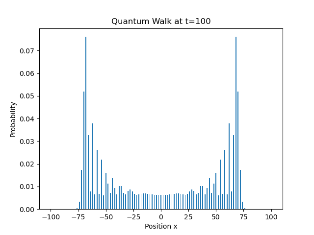

# Quantum Walk Simulation

One-dimensional discrete-time quantum walk simulation written in Python.

## Features

- Hadamard coin
- Probability distribution calculation
- Probability distribution visualization

## Background

This project was created while studying quantum information and quantum walks.

## Result

## Physics

This simulation demonstrates the ballistic spreading
of a discrete-time quantum walk.

Unlike a classical random walk,
the probability distribution develops two peaks
due to quantum interference.
